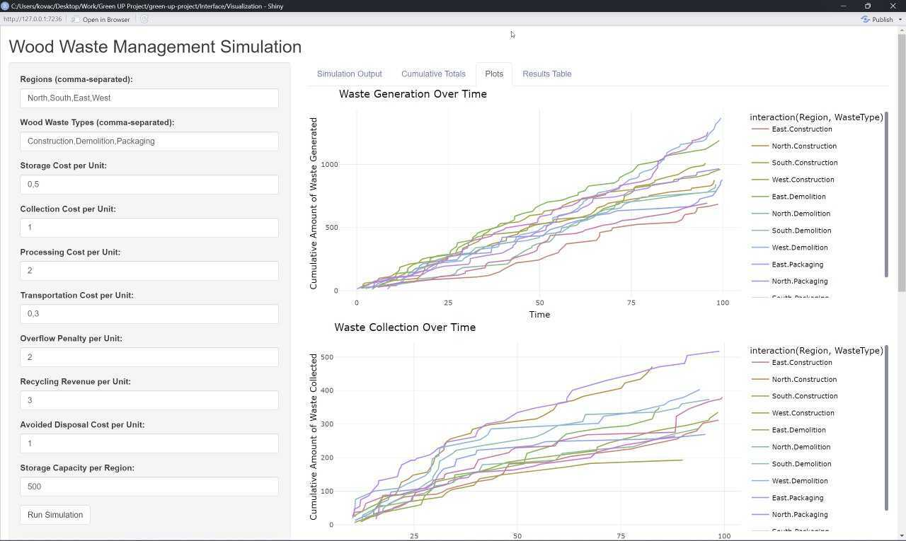
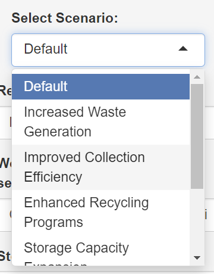
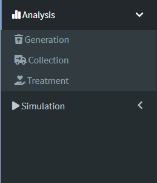
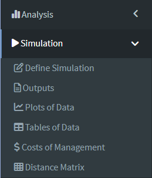
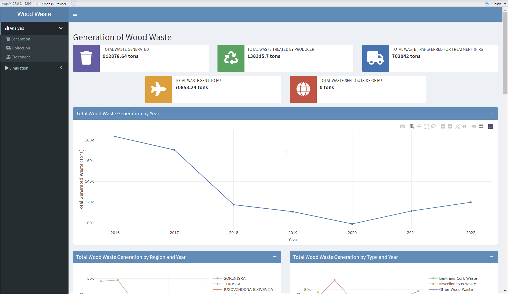
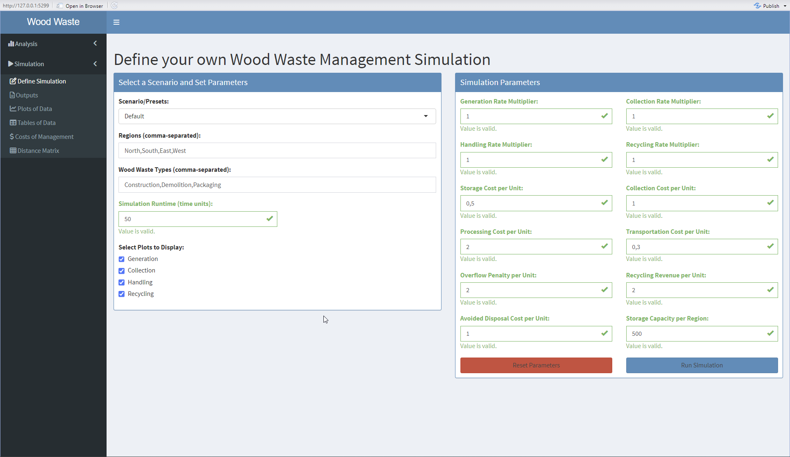

---
editor_options:
    markdown:
        wrap: 72
---

# Visualization Tool Report

## 1. General Information

-   **Author:** Nikola Kovačević
-   **Enrollment Number:** 89232043
-   **Demo Video URL:** [link to the video](https://youtu.be/EHsPvZrCqcg)
-   **Data Obtained From:** [link to the data](https://www.arso.gov.si/varstvo%20okolja/odpadki/poro%C4%8Dila%20in%20publikacije/)

## 2. Overall Description

The visualization tool is designed for data analysts and perhaps environmental policymakers interested in waste management trends in Slovenia. It provides an interactive dashboard for exploring various aspects of waste generation, collection, and treatment across different regions and municipalities. The tool allows users to analyze trends over time, compare regions, and drill down into specific waste types and treatment methods. By visualizing complex waste management data, it enables users to identify patterns, make data-driven decisions, and monitor the effectiveness of waste management policies.

The tool consists of two main components: Analysis and Simulation. The Analysis component focuses on visualizing historical data and trends, while the Simulation component allows users to model and predict future scenarios based on adjustable parameters.

## 3. Tasks

The visualization tool supports the following tasks:

1. Analyze overall waste generation trends across years and regions
2. Compare waste collection and management practices among different municipalities
3. Examine the distribution of different types of waste and their treatment methods
4. Investigate the efficiency of waste treatment processes over time
5. Assess the impact of waste management policies on waste reduction and recycling rates
6. Simulate future waste management scenarios based on adjustable parameters
7. Evaluate the cost-effectiveness of different waste management strategies

## 4. Design of the Visualization

### Prototype Explorations

This project started as a way to have an interface for defining the Wood
Waste Simulation based on the analysis we did from the data on waste
generation and management.

This analysis was done prior to the creation of the tool.

#### Prototype 1 - Defining a Simulation Interface

|  |
| :---------------------------------------------------------------------------------------------------------------------------------------------: |
|                                _Initial version of the Interface for defining user made Wood Waste Simulation._                                 |

The layout was divided into two: the left side with the option to define
the parameters and the right view with the views that consisted of the
simulation output, cumulative tables, plots based on the tables and
overall results table.

The advantage of this view was that it had the parameters on the screen
at all times, meaning we are not losing track of what we inputted.

The limitations of this view are the lack of filtering options,
tooltips, ways to guide the user and explain them which parameters
affect what.

#### Prototype 2 - Adding Scenario Options to the Interface

  

  <em>Second version of the Interface with the Scenario options.</em>

The second protype consisted of the Scenario functionality, which gave
users the option to try out some presets to get a feel of how the
simulation tool works. Each scenario change one or multiple things
depending on the wanted outcome.

#### Prototype 3 - Splitting the tool into two: Analysis and Simulation

As we were working on the simulation tool, we decided that the tool itself
was not enough and that it would be fitting to accompany it with the
Analysis part of how we got to creating the tool at start. So this is
when the tool was split into two and we established two views: Analysis and
Simulation.

  <table style="margin: 0 auto;">
    <tr>
      <td style="padding-right: 20px; text-align: center; vertical-align: middle;">
        
        
<em>Analysis views.</em>

      </td>
      <td style="padding-left: 20px; text-align: center; vertical-align: middle;">
        
        
<em>Simulation views.</em>

      </td>
    </tr>
  </table>

### Final Prototype

|  |
| :-------------------------------------------------------------------------------------------------------------------------------------------------: |
|                               _The starting view of the Interface, the Analysis, and a look at the Generation page._                                |

|  |
| :-----------------------------------------------------------------------------------------------------------------------------------------------------------------: |
|                                        _The Simulation view, and a look at the settings screen for defining the simulation._                                        |

### Design Rationale

#### Color Choice

We did not follow a strict guideline, but we always tried to distinguish different categories with different colors. For example, highlighting different sources in the total wood waste received by source or the different waste types in the waste collected by types for the collection of waste based on the municipality.

#### Design Principles

-   Consistency: A uniform layout and color scheme are maintained across all views.
-   Simplicity: Each chart focuses on one key aspect of the data to avoid overwhelming the user.

#### Use of Views

-   Multiple linked views are used to show different aspects of the waste management process.
-   Views are organized from general (overall trends) to specific (detailed breakdowns by waste type or region).
-   This spatial organization allows users to start with an overview and then drill down into details.

#### Interactivity

-   Dropdown menus and sliders for filtering data by year, region, and waste type.
-   Hover functionality for detailed information on data points.
-   Zoom and pan capabilities in map and chart views.

#### Visualizations in Each View

-   Line charts for temporal trends (e.g., total waste by year).
-   Bar charts for comparing categories (e.g., waste by region or type).
-   Maps for geographical distribution of average municipal waste collected for treatment.
-   Waterfall charts for visualizing changes in waste storage over time.

#### Alignment with Goals

The tool addresses the needs of data analysts and policymakers by providing both broad overviews and detailed breakdowns of waste management data. It supports all identified tasks through its interactive features and diverse visualizations, enabling users to explore data from multiple perspectives.

We also feel like it suits to quickly give a newcomer to the field a glance of how the waste management in Slovenia is done and what are the trends that are happening.

## 5. User Scenario

A regional environmental policymaker wants to assess the effectiveness of recent recycling initiatives. They would:

1. Open the Analysis tab and view the "Total Waste Generated" trend over the past five years.
2. Use the region filter to focus on their specific region.
3. Examine the "Waste by Type" chart to see if the proportion of recyclable waste has decreased.
4. Switch to the "Collection" sub-tab to compare their region's collection rates with neighboring regions.
5. Use the "Treatment" sub-tab to analyze how much of the collected waste is being recycled.
6. Based on these insights, they can determine if the recycling initiatives are having the desired effect and where improvements might be needed.
7. Navigate to the Simulation tab to model future scenarios based on current trends.
8. Adjust parameters such as recycling rate increase and collection cost to see potential outcomes.
9. Compare simulated results with target goals to inform policy decisions.

## 6. Simulation Component

### 6.1 Overview

The simulation component of the visualization tool allows users to model and predict future waste management scenarios. It uses a discrete event simulation approach to simulate the generation, collection, handling, and recycling of different types of wood waste across multiple regions.

### 6.2 Key Features

1. **Scenario Selection:** Users can choose from predefined scenarios or create custom ones by adjusting various parameters.
2. **Parameter Adjustment:** Interactive sliders and input fields for modifying key parameters such as:
    - Generation rate increase
    - Collection rate increase
    - Handling rate increase
    - Recycling rate increase
    - Storage capacity
    - Various cost factors (storage, collection, processing, transportation)
    - Recycling revenue and avoided disposal costs
3. **Multi-Region Simulation:** Ability to simulate waste management processes across multiple regions simultaneously.
4. **Multiple Waste Types:** Support for different types of wood waste, each with its own characteristics and processing requirements.
5. **Time-based Simulation:** Users can set the simulation runtime to model short-term or long-term scenarios.
6. **Intelligent Collection:** Adaptive collection rates based on waste accumulation and storage capacity.
7. **Storage Balancing:** Automatic balancing of waste storage across regions to optimize transportation and storage costs.

### 6.3 Simulation Process

1. **Waste Generation:** Simulates the creation of waste in each region based on adjustable rates and seasonal variations.
2. **Waste Collection:** Models the collection process, considering factors like collection frequency and capacity.
3. **Waste Handling:** Simulates the processing of collected waste, including associated costs.
4. **Recycling:** Models the recycling process, including revenue generation from recycled materials.
5. **Storage Management:** Tracks waste storage levels and applies penalties for overflow situations.
6. **Inter-regional Transportation:** Simulates the movement of waste between regions to balance storage and optimize costs.

### 6.4 Output Visualizations

1. **Time Series Plots:**
    - Waste generation over time
    - Waste collection over time
    - Waste handling over time
    - Recycling rates over time
2. **Cost Analysis Plots:**
    - Collection costs over time
    - Processing costs over time
    - Transportation costs over time
    - Recycling revenue over time
3. **Summary Tables:**
    - Cumulative totals for waste generated, collected, handled, and recycled
    - Detailed breakdown of costs and revenues by region and waste type
4. **Interactive Data Tables:** Allowing users to explore detailed simulation results

### 6.5 User Interaction

1. **Parameter Adjustment:** Users can modify simulation parameters in real-time and observe the effects on waste management outcomes.
2. **Region and Waste Type Selection:** Ability to focus on specific regions or waste types for detailed analysis.
3. **Time Range Selection:** Users can zoom in on specific time periods in the simulation results.
4. **Scenario Comparison:** Functionality to run multiple scenarios and compare their outcomes side by side.

### 6.6 Integration with Analysis Component

The simulation component is tightly integrated with the analysis component, allowing users to:

1. Use historical data from the analysis component to inform parameter settings in the simulation.
2. Compare simulated future scenarios with historical trends.
3. Validate simulation models against known historical data.

## 7. Difficulties

The data was not in the best shape and it took a lot of time to clean it up and make it usable for the tool. The data was also not in the best format for the simulation tool, so we had to make some assumptions and simplifications to make it work. We do not have all the data from all the years, so that is why for some analysis the time span is shorter than for others, for example from 2018 to 2022, where as for some it is from 2016 to 2022.

We wanted to establish views per company, per municipality and then per region, but again that was not possible, as every year the template of the data changed and we had to adapt to that.
